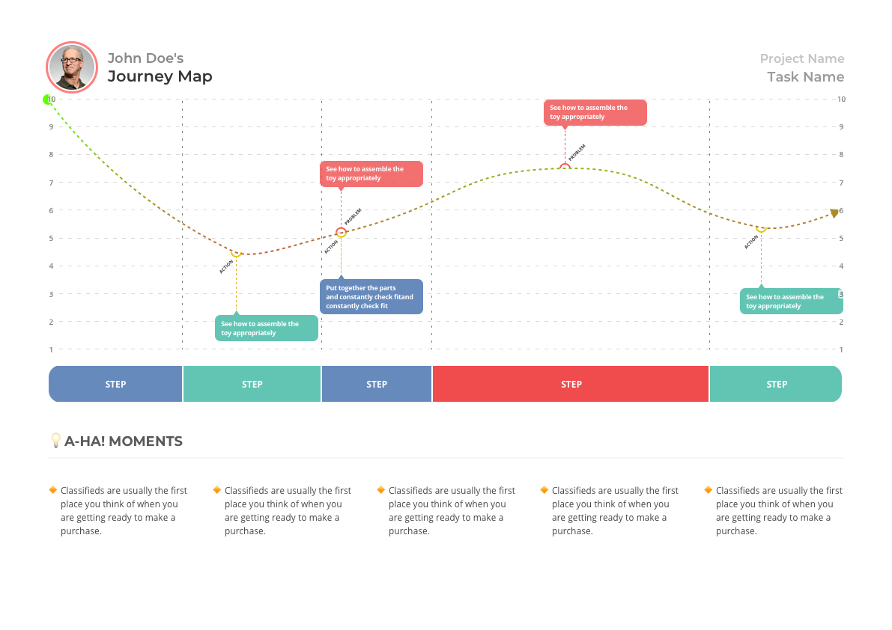

# UX User Journey Map Sketch Template

----
## What is this?
I have crafted this template file to create User Journey Maps during my UX research tasks. 

----
## usage
1. Open the file
2. Draw the line (Path)
3. Insert State symbols for problems or actions
4. Profit

----
## features
I tried to keep all modules as symbols so they can be easily editable and manageable. 

P.S. Feel free to iterate, update, make it better. 

Good luck and all the best to you in your work.